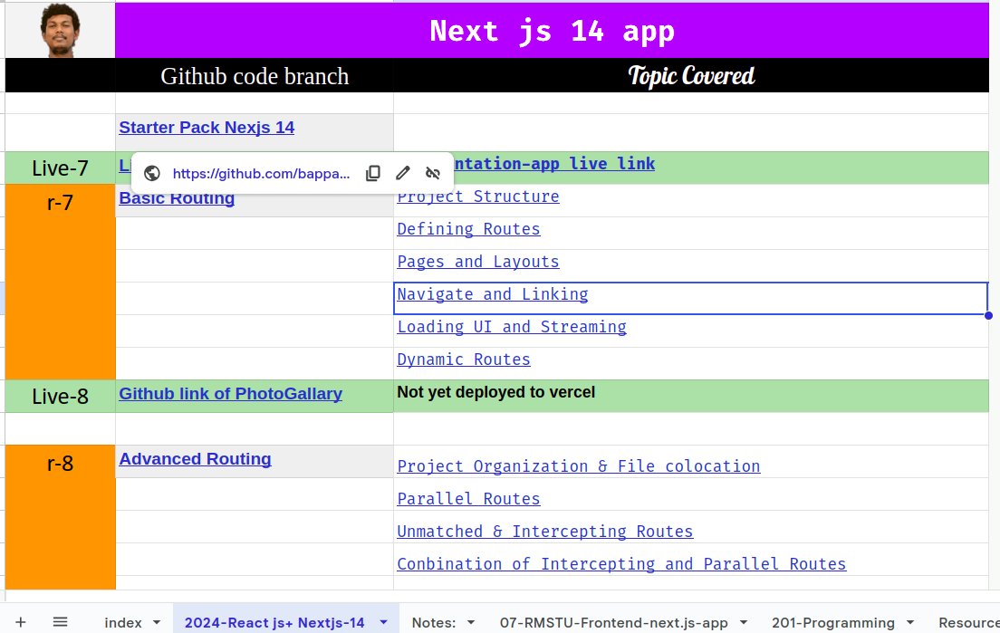

### My Roadmap 
- [My learning roadmap](https://docs.google.com/spreadsheets/d/1MBXwR8tweXomw-iDjiiWFAZovhVCEC7w_asXQzT0pYE/edit#gid=2003874262)

## React Notion Hand Note
- [React-18](https://www.notion.so/React-Note-2024-937311c869de4060b21fc37dd2120e33?pvs=4)
- [TypeScript-Notes](https://snapdragon-mambo-8cb.notion.site/TypeScript-ad7a23778eea4ba4bee18f944e8fb0c2)

## Search Projects From My Github with source code

 

  
🇷‌🇪‌🇦‌🇨‌🇹‌       𝗣𝗥𝗢𝗝𝗘𝗖𝗧 

| Project Name 🌐 [Live-link ]                                           | Github_link + Level                                                                                                                  |Lavel + Description + Technology                                                                                               |
| ---------------------------------------------------------------------- | ------------------------------------------------------------------------------------------------------------------------------------ | ---------------------------------------------------------------------------------------------------------------------- |
| ⭐ [Smart Grade System ](https://smart-grade-vercel-three.vercel.app/) | **🔒-private**                                                                                                                       | **[Beginner]** Html to react component                                                                                 |
| ⭐ Tic Tac Toe                                                         | [🐞](https://github.com/bappasahabapi/tic-tac-toy-2024)                                                                              | **[MID]** Basic Tic Tac Toy game which is created by by following the official document of react dev.                  |
| ⭐ [Book Finder App](https://book-finder-app-one.vercel.app/)          | **🔒-private**                                                                                                                       | **[Beginner]** Implemented searching,filtering, sorting,favorite option using useState hook only                       |
| ⭐ [BD-Tour](https://bd-tour-7c15d.web.app/)                           | [Client](https://github.com/bappasahabapi/bd-tour-client) [server](https://github.com/bappasahabapi/bd-tour-server)                  | **[MID]** Firebase Google authentication, CRUD operation using MongoDB.Backend should be deployed heroku to vercel       |
| ⭐ [Iphone-BD](https://iphone-bd.web.app/)                             | [Client](https://github.com/bappasahabapi/iPhone-bd-client) [server](https://github.com/bappasahabapi/iPhone-bd-server)             | **[Advanced]** Firebase Google authentication, CRUD operation using MongoDB .Backend should be deployed heroku to vercel |
| ⭐ [Thakurgaon-Hospital](https://thakurgaon-hospital.web.app/)         | [Client](https://github.com/bappasahabapi/Thakurgaon-Healthcare)                                                                    | **[MID]** Firebase Google authentication, CRUD operation using MongoDB .Backend should be deployed heroku to vercel      |
| ⭐ [Thakurgaon-Portal](https://thakurgaon-portal.web.app/)             | [Client](https://github.com/bappasahabapi/Thakurgaon-Portal-UI) [server](https://github.com/bappasahabapi/Thakurgaon-Portal-Server) | **[MID]** Firebase Google authentication, hosted firebase for front-end, server is in Vercel                             |
| -                                                                      | -                                                                                                                                    | -                                                                                                                      |

-- 

- <h1>Next js-14 𝗣𝗥𝗢𝗝𝗘𝗖𝗧</h1>

    

    
Github link with source code

  - [Next js-14 Starer](https://github.com/bappasahabapi/react-vite-2024/tree/starter/Nextjs-14) 
  - [Next js-14 Basic Routing](https://github.com/bappasahabapi/react-vite-2024/tree/r7/7.0/Nextjs-14/basic-routing)
  - 🚇 Implemented Project is: [nextjs-14-documentation-app](https://github.com/bappasahabapi/nextjs-14-documentation-app)
  
    

- <h1>Next js-13 𝗣𝗥𝗢𝗝𝗘𝗖𝗧</h1>

    

    
Next js 13 Project <b>[typescript + redux+ rtk + antd ]</b> 

    -  [RMSTU-Frontend-13.4 app-base](https://github.com/bappasahabapi/rmstu-frontend)
    -  [next-js-13.4-pageRoute-app](https://github.com/bappasahabapi/next-js-13.4-pageRoute-app)
    -  [next-js-13.4-pagebase-NewsPortal](https://github.com/bappasahabapi/next-js-13.4-pagebase-NewsPortal)
    -  [next-js13-page-projects](https://github.com/bappasahabapi/next-js13-page-projects)

    

    
